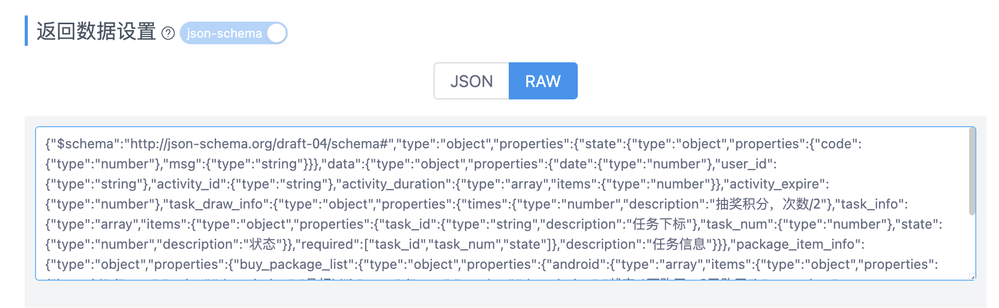
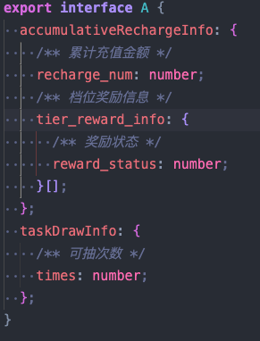

# 步骤

1. 打开接口文档的编辑 -> 返回数据设置 -> 复制 RAW



2. 粘贴生成 ts 类型

# 使用

1. 定义一个 .d.ts 文件



2. 引入, 只需要在变量前使用 `/** @type {import('./a.d.ts').A} */` 注释即可

```js
data() {
  return {
    /** @type {import('./a.d.ts').A} */
    a: {},
  }
}
```
